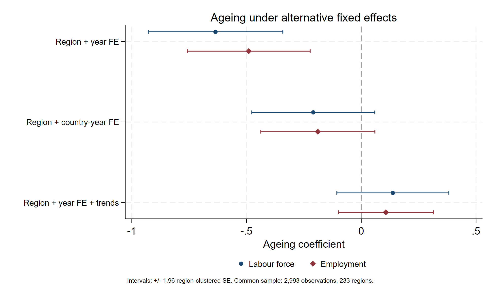

# Workforce Ageing and Labour Productivity in European Regions: Stata replication

This is my Stata port of the analysis in *Workforce Ageing and Labour Productivity in European NUTS2 Regions: Evidence from Fixed Effects and Instrumental Variables*, a group project by Tommaso Fabbrini, Raffaele Bozzi, Fangrui Ju, Gaetano Liantonio and Ettore d'Addio for the MSc in Applied Economics at Luiss Guido Carli (April 2026). The paper and the original MATLAB code are in the [project repository](https://github.com/RaffaeleBozzi/eu-regional-ageing-productivity) ([paper, PDF](https://github.com/RaffaeleBozzi/eu-regional-ageing-productivity/blob/main/paper/Workforce_Ageing_and_Labour_Productivity.pdf)).

I rewrote the estimation in Stata, starting from the regression panels built by the MATLAB code, and checked every result against the original output. The data construction was not ported; the panels in `data/` come from the original project.

## The study

The paper asks whether regions with an older workforce are less productive. The panel covers 243 NUTS2 regions from 2001 to 2023 and is built from Eurostat and ARDECO data. Productivity is log real gross value added per hour worked. Ageing is the share of workers aged 55–64 among those aged 15–64, measured either in the labour force (LF) or in employment (EMP); the two measures enter separate regressions. The controls are the agriculture and industry shares of hours worked, tertiary education and lagged capital intensity. In the IV model, ageing is instrumented with the share of the population aged 45–54 ten years earlier.

## Results

Coefficient on ageing, with standard errors clustered by region:

| Specification | LF | EMP | Observations |
|---|---:|---:|---:|
| Region and year effects | −0.635 (0.150) | −0.490 (0.137) | 2,993 |
| Region and country-year effects | −0.209 (0.137) | −0.189 (0.127) | 2,993 |
| Region and year effects, regional trends | 0.138 (0.125) | 0.107 (0.106) | 2,993 |
| FE OLS, IV sample | −0.574 (0.154) | −0.438 (0.140) | 2,815 |
| FE-2SLS | −1.120 (0.328) | −1.104 (0.327) | 2,815 |

The coefficient is negative and significant with region and year effects and in the IV model. With country-year effects or regional trends it is no longer significant. The first-stage F statistic is 307 for LF and 322 for EMP.



## Comparison with MATLAB

`07_compare_matlab_stata.do` compares each Stata estimate with the MATLAB one: the 22 estimates in the paper tables and the control-function endogeneity test. For all fixed-effects and IV models, coefficients and standard errors are identical up to rounding (differences below 10⁻⁸), and each model uses exactly the same region-year observations. The clustered standard errors match because `regress` with `vce(cluster)` and `ivregress` with the `small` option apply the same finite-sample correction as the MATLAB code.

The pooled regressions are the exception. The paper labels them OLS, but the MATLAB code estimates them by robust regression (`fitlm` with bisquare weights), and Stata has no built-in command for the same estimator. For these models the code reports `rreg` and OLS with robust standard errors, which give the same signs as MATLAB and different magnitudes.

The comparison is saved in `output/stata_matlab_comparison.csv`. The MATLAB estimates in `benchmarks/matlab_reference.csv` come from the paper tables and, for the control-function test, from a run of the original code; the same run produced `benchmarks/matlab_sample_keys.csv`, the region-years used by each model.

## How to run

The code needs Stata 19 or later and no user-written packages; I ran it with Stata/SE 19.5 on Windows. With the repository folder as working directory:

```stata
do "do/master.do"
```

From another directory, pass the folder as an argument: `do "<path>/do/master.do" "<path>"`. A full run takes less than a minute: it imports the panels, estimates all models, runs the comparison and writes the results and the figure to `output/`. It stops with an error if a sample or an estimate differs from the expected one.

## Code

| Do-file | Content | MATLAB script |
|---|---|---|
| `00_setup_import.do` | Import and checks of the four panels | – |
| `01_baseline_models.do` | Pooled regressions, two-way FE | `Estimation.m` |
| `02_fe_robustness.do` | Two-way FE under three sample rules | `Estimation_Robustness.m` |
| `03_identification_robustness.do` | Country-year effects, regional trends | `Identification_Robustness.m` |
| `04_endogeneity_test.do` | Control-function test | `Endogeneity_Test_IV.m` |
| `05_first_stage_iv.do` | First stage | `First_Stage_IV.m` |
| `06_fe_2sls.do` | FE OLS and FE-2SLS | `IV_2SLS_FE.m` |
| `07_compare_matlab_stata.do` | Comparison with MATLAB, figure | – |

`master.do` runs them in order; `lib/` contains the sample construction and the program that stores each result. `data/` holds the four regression panels, `benchmarks/` the MATLAB estimates and `output/` the results.

## Data and license

The panels in `data/` are the processed files of the original project, built from Eurostat and ARDECO (European Commission) data. Sources and construction are documented in the [project repository](https://github.com/RaffaeleBozzi/eu-regional-ageing-productivity). The code is released under the [MIT License](LICENSE); the data are not covered by it.
